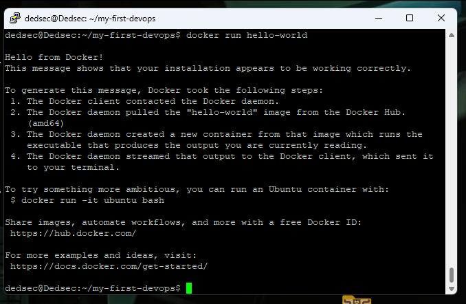

My DevOps Project

This is my step into the world of DevOps.
My DevOps Project

Выполненные шаги

Часть 1: Установка Git и настройка GitHub
- Установлен Git на Ubuntu Server. Проверка: `git --version`.
- Сгенерирован и добавлен SSH-ключ в аккаунт GitHub для безопасного подключения.

Часть 2: Работа с GitHub
- Создан публичный репозиторий `my-first-devops`.
- Репозиторий клонирован на локальную машину через SSH.

Часть 3: Установка и работа с Docker
- Docker успешно установлен по официальной инструкции.
- Проверка: `docker --version`.
- Запущен тестовый контейнер `hello-world` для проверки корректности установки.

Часть 4: Создание собственного Docker-образа
- Создан `Dockerfile` для запуска простого Python-скрипта.
- Создан файл `script.py`, который выводит сообщение "Hello, DevOps World!".
- Образ успешно собран с тегом `my-python-app`.
- Контейнер запущен и вывел ожидаемое сообщение.

  
Скриншоты: 
 

  
   
  <em>Hello from Docker - запуск команды docker run hello-world</em>

  
   
  <em>Hello, DevOps World! - контейнер со скриптом python</em>

